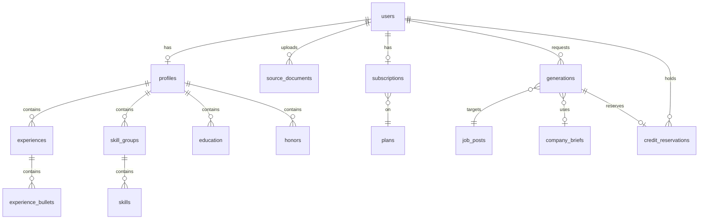

# Data model

Entities, columns, and the invariants that aren't visible in the schema. This is
the contract between the generation pipeline, the renderer, and the billing
meter — read it before writing migrations or touching the rewrite prompt's
output schema.

Decisions this encodes: [ADR-0001](../decisions/0001-generation-pipeline.md)
(pipeline phases), [ADR-0002](../decisions/0002-profile-sources.md) (two profile
sources), [ADR-0004](../decisions/0004-pricing-and-quota.md) (reserve-then-settle,
brief cache).

## Conventions

- **Primary keys** — `uuid`, default `gen_random_uuid()` (core in PG 13+).
- **Timestamps** — `timestamptz`, always UTC. Every table has `created_at`;
  mutable tables also have `updated_at`.
- **Money** — integer cents. Never a float, never a numeric-typed dollar amount.
- **Enums** — Postgres enums via Drizzle `pgEnum`, not free text.
- **Ordering** — user-reorderable lists carry an integer `position`, not an
  implicit `created_at` sort.
- **Deletes** — deleting a user cascades to everything they own. Generations are
  retained on plan downgrade (history stays readable); only user deletion removes
  them.
- **Dates on a resume** — `date`, not `timestamptz`. An `end_date` of `NULL`
  means "Present".



---

## Auth

### `users`

| Column | Type | Notes |
|---|---|---|
| `id` | uuid PK | |
| `email` | citext UNIQUE NOT NULL | `citext` so casing can't create duplicate accounts |
| `password_hash` | text NOT NULL | argon2id |
| `email_verified_at` | timestamptz NULL | **Gates the first generation** (ADR-0004) |
| `token_version` | integer NOT NULL DEFAULT 0 | Bump to invalidate every outstanding JWT |
| `created_at` / `updated_at` | timestamptz | |

`token_version` is the whole logout-everywhere mechanism — it rides in the JWT
claims and is compared on each request. It exists so there's no session table.

### `email_verification_tokens` / `password_reset_tokens`

Same shape: `id`, `user_id` FK, `token_hash` (store the **hash**, never the
token), `expires_at`, `consumed_at`, `created_at`.

Verification tokens expire in 24h, reset tokens in 1h. Consumed tokens are kept,
not deleted — a reused link should say "already used", not "invalid".

---

## Profile (structured source)

Per ADR-0002 this is one of two inputs, and it is **canonical**: where it and the
source document disagree, this wins. It is also what the renderer reads for
layout.

### `profiles`

One row per user.

| Column | Type | Notes |
|---|---|---|
| `id` | uuid PK | |
| `user_id` | uuid UNIQUE FK → users | |
| `full_name` | text NOT NULL | |
| `headline` | text | Default headline. The rewrite overrides it per job. |
| `location_line` | text | e.g. "Remote-First (US Timezone Aligned)" |
| `summary` | text | Base summary; rewritten per job |
| `contacts` | jsonb | `[{ "label": "GitHub", "url": "..." }]`, ordered |

### `experiences`

| Column | Type | Notes |
|---|---|---|
| `id` | uuid PK | |
| `profile_id` | uuid FK → profiles | |
| `company` | text NOT NULL | |
| `title` | text NOT NULL | |
| `location` | text | "Delaware, United States (Remote)" |
| `start_date` | date NOT NULL | |
| `end_date` | date NULL | NULL = Present |
| `position` | integer NOT NULL | Newest first in the UI; this is user-controlled |

### `experience_bullets`

| Column | Type | Notes |
|---|---|---|
| `id` | uuid PK | |
| `experience_id` | uuid FK → experiences | |
| `text` | text NOT NULL | May contain `**bold**` markers |
| `in_bank` | boolean NOT NULL DEFAULT false | See below |
| `link_label` | text NULL | e.g. `View Project` |
| `link_url` | text NULL | |
| `position` | integer NOT NULL | |

**`in_bank` is load-bearing.** It reproduces the source workflow's "bullet bank":
bullets that are true and verified but kept off the default resume for space. The
rewrite step may select them when a role calls for it. They are *not* second-class
or unverified — they are overflow inventory. A bullet with `in_bank = true` never
renders unless the rewrite explicitly picks it.

`link_label`/`link_url` model the `[View Project]` token. The renderer moves these
onto the company line, right-aligned — they are not inline in the bullet.

### `skill_groups` / `skills`

`skill_groups`: `id`, `profile_id`, `category` (text, e.g. "Frontend"),
`position`.
`skills`: `id`, `group_id`, `name` (text), `position`.

Individually rowed rather than a text array so the rewrite can reorder and the
gap analysis can match a job's must-haves against specific entries.

Skills must be concrete tools (`jest`, `playwright`), never categories
(`testing`). Enforce in the UI copy and in the rewrite prompt, not the schema.

### `education` / `honors`

`education`: `id`, `profile_id`, `institution`, `degree`, `field`, `start_date`,
`end_date`, `position`.
`honors`: `id`, `profile_id`, `title`, `issuer`, `awarded_on` (date), `position`.

---

## Source documents (uploaded source)

The second input from ADR-0002. Parsed once at upload; the parsed text — not the
binary — is what the rewrite call receives.

### `source_documents`

| Column | Type | Notes |
|---|---|---|
| `id` | uuid PK | |
| `user_id` | uuid FK → users | |
| `storage_key` | text NOT NULL | Original file in object storage |
| `filename` / `mime_type` / `size_bytes` | text / text / integer | |
| `parse_status` | enum | `pending` \| `parsing` \| `ready` \| `failed` |
| `parse_error` | text NULL | |
| `content_md` | text NULL | Canonical parsed markdown. **User-editable.** |
| `is_active` | boolean NOT NULL DEFAULT true | |
| `created_at` / `updated_at` | timestamptz | |

The original binary is retained deliberately so documents can be re-parsed when
the parser improves. `content_md` being editable is the mitigation for parse
errors — show the user what was extracted and let them fix it.

A user may have several; only `is_active` rows feed generation. Multiple active
documents are allowed and are all passed in (a full-stack variant plus a frontend
variant, say).

---

## Generation

### `job_posts`

Archived because postings get taken down and are needed later for interview prep.

| Column | Type | Notes |
|---|---|---|
| `id` | uuid PK | |
| `user_id` | uuid FK → users | |
| `source_url` | text NULL | NULL when pasted |
| `raw_text` | text NOT NULL | Fetched or pasted |
| `content_hash` | text NOT NULL | sha256 of normalized `raw_text` |
| `company_name` | text NULL | Resolved employer, not the recruiter |
| `company_domain` | text NULL | Cache key into `company_briefs` |
| `role_title` | text NULL | |
| `is_anonymous` | boolean NOT NULL DEFAULT false | Recruiter/stealth listing |
| `parsed` | jsonb NULL | Role signals, must-haves, nice-to-haves, responsibilities, keywords, hidden_problem |

UNIQUE on `(user_id, content_hash)` — re-pasting the same posting reuses the row
rather than re-archiving it.

`company_domain` is NULL when `is_anonymous`. Anonymous postings **skip the brief
cache entirely** — there's no stable key, and caching a recruiter's brief under a
made-up key would poison results for everyone.

### `company_briefs` — the cost cache

**Global, not per-user.** This is the ADR-0004 cost optimization: a hit drops a
generation from ~$0.40 to ~$0.14.

| Column | Type | Notes |
|---|---|---|
| `id` | uuid PK | |
| `domain` | text UNIQUE NOT NULL | Cache key, normalized lowercase, no `www.` |
| `company_name` | text NOT NULL | |
| `brief` | jsonb NOT NULL | See "Company brief" below |
| `researched_at` | timestamptz NOT NULL | |
| `expires_at` | timestamptz NOT NULL | `researched_at + 7 days` |

Lookup is `WHERE domain = ? AND expires_at > now()`. Expired rows are kept, not
deleted — they're useful for diffing how a company's positioning drifts, and
they're cheap.

**Never cache a brief for an anonymous posting.**

### `generations`

| Column | Type | Notes |
|---|---|---|
| `id` | uuid PK | |
| `user_id` | uuid FK → users | |
| `job_post_id` | uuid FK → job_posts | |
| `company_brief_id` | uuid NULL FK → company_briefs | NULL for anonymous postings |
| `status` | enum | `queued` \| `researching` \| `analyzing` \| `rewriting` \| `rendering` \| `succeeded` \| `failed` \| `canceled` |
| `error` | text NULL | |
| `resume_json` | jsonb NULL | The rendered artifact. See below. |
| `gap_report` | jsonb NULL | Shown in the review UI |
| `change_log` | jsonb NULL | Shown in the review UI |
| `pdf_storage_key` | text NULL | |
| `brief_cache_hit` | boolean NOT NULL DEFAULT false | |
| `model` | text NOT NULL | e.g. `claude-opus-5` |
| `input_tokens` / `output_tokens` / `cached_input_tokens` | integer | |
| `cost_cents` | integer NULL | |
| `started_at` / `finished_at` | timestamptz NULL | |

**The token and cost columns are not optional.** The ~$0.40 COGS figure in
ADR-0004 is an unvalidated estimate, and the price points depend on it. Record
usage from the first run so the estimate can be replaced with a measurement
before pricing goes public.

`status` doubles as the SSE progress feed — the client renders the phase names
directly, so don't rename them without updating the UI copy.

---

## Billing and quota

### `plans`

Seeded, not user-editable. Keeping plans in the DB rather than in code means
limits can be adjusted without a deploy.

| Column | Type | Notes |
|---|---|---|
| `code` | text PK | `trial` \| `pro` \| `power` |
| `name` | text NOT NULL | |
| `price_cents` | integer NOT NULL | 0 for trial |
| `generation_limit` | integer NOT NULL | 2 / 25 / 100 |
| `period` | enum NOT NULL | `lifetime` \| `month` |
| `daily_cap` | integer NOT NULL | Abuse guard; applies to paid plans too |
| `stripe_price_id` | text NULL | NULL for trial |
| `is_active` | boolean NOT NULL DEFAULT true | Retire a plan without deleting it |

Trial is `period = 'lifetime'` with `generation_limit = 2` — this is what makes it
a trial rather than a recurring free tier.

### `subscriptions`

One row per user, created at signup on the `trial` plan.

| Column | Type | Notes |
|---|---|---|
| `id` | uuid PK | |
| `user_id` | uuid UNIQUE FK → users | |
| `plan_code` | text FK → plans | |
| `stripe_customer_id` | text NULL | |
| `stripe_subscription_id` | text NULL | |
| `status` | enum | `trialing` \| `active` \| `past_due` \| `canceled` |
| `current_period_start` / `current_period_end` | timestamptz NULL | NULL on the lifetime trial |
| `cancel_at_period_end` | boolean NOT NULL DEFAULT false | |

**Stripe webhooks are the source of truth for `status` and `plan_code`.** Never
grant entitlement from a checkout redirect — the user can reach the success URL
without the payment settling.

### `credit_reservations` — the meter

This table *is* the reserve-then-settle mechanism from ADR-0004.

| Column | Type | Notes |
|---|---|---|
| `id` | uuid PK | |
| `user_id` | uuid FK → users | |
| `generation_id` | uuid UNIQUE NULL FK → generations | |
| `state` | enum NOT NULL | `reserved` \| `committed` \| `released` |
| `period_start` / `period_end` | timestamptz NULL | Snapshotted at reserve time; NULL for lifetime |
| `created_at` / `settled_at` | timestamptz | |

**Quota consumed** = rows where `state IN ('reserved','committed')` within the
current period. `released` rows do not count — that's how a failed generation
stops being billed to the user.

**The reserve must be atomic.** Two browser tabs can otherwise both spend the
last credit:

```sql
BEGIN;
  SELECT * FROM subscriptions WHERE user_id = $1 FOR UPDATE;  -- serialize per user
  -- count reservations in ('reserved','committed') for the period
  -- count reservations created in the last 24h for the daily cap
  -- if either limit is hit, ROLLBACK and return 402/429
  INSERT INTO credit_reservations (..., state) VALUES (..., 'reserved');
COMMIT;
-- enqueue only after COMMIT succeeds
```

Locking the `subscriptions` row is the serialization point. Do not lock
`credit_reservations` — there's no row to lock before the first insert.

**Release on failure is the easiest thing to get wrong.** A crashed worker leaves
a reservation stuck in `reserved` forever, silently burning the user's quota.
Needs a sweeper that releases reservations whose generation has been terminal for
more than N minutes, and test coverage on the release path.

### `stripe_events`

`event_id` (text PK), `type`, `payload` (jsonb), `processed_at`.

Idempotency, not an audit log. Stripe retries webhooks; insert the id first and
let the unique violation tell you it's a duplicate.

---

## JSON payload shapes

These are contracts between the LLM's structured output and the renderer. Change
them and both the prompt schema and the PDF template must change together.

### `generations.resume_json`

Section order matches the source workflow's template.

```jsonc
{
  "header": {
    "name": "string",
    "headline": "Exact Job Title | Stack | Specialty",
    "location_line": "string",
    "contacts": [{ "label": "string", "url": "string" }]
  },
  "summary": "string",
  "skill_groups": [{ "category": "Frontend", "skills": ["typescript", "react"] }],
  "experience": [{
    "company": "string",
    "title": "string",
    "location": "string",
    "start_date": "2025-05",         // YYYY-MM
    "end_date": null,                 // null = Present
    "link": { "label": "View Project", "url": "..." } | null,
    "bullets": ["Cut time to first response from **12s to 380ms** ..."]
  }],
  "education": [{ "institution": "...", "degree": "...", "field": "...",
                  "start_date": "YYYY-MM", "end_date": "YYYY-MM" }],
  "honors": [{ "title": "...", "issuer": "...", "awarded_on": "YYYY-MM" }]
}
```

Bullet rules the renderer and the prompt both depend on:

- **`**bold**` is the only markup allowed** in bullet text. Metrics and 1–2 key
  technologies, 2–4 per bullet.
- **One line per bullet in the rendered PDF**, 90–105 characters. Enforced by the
  template, not by re-prompting.
- Max 4 bullets per role.
- The role `link` renders on the company line, right-aligned — it is not inline
  in a bullet.

### `company_briefs.brief`

```jsonc
{
  "mission": "string",
  "product": "string",
  "domain": "string",
  "values": ["string"],
  "tone": "playful | academic | terse | mission-heavy | ...",
  "tech_signals": ["string"],
  "why_them_hook": "string",
  "vocabulary": ["string"],
  "unknown_fields": ["values"]
}
```

Fields that couldn't be researched go in `unknown_fields` rather than being
guessed. **Never invent company facts** — this is the same no-invention rule that
governs resume content.

### `generations.gap_report`

```jsonc
{
  "gaps": [{
    "section": "Skills",
    "current": "string",
    "job_wants": "string",
    "gap_type": "missing keyword | weak framing | wrong emphasis | missing skill |
                 missing experience | untranslated experience | missing impact |
                 missing metric",
    "priority": "fix now | ask user | nice to have | already covered",
    "fix": "string"
  }]
}
```

`ask user` means a real gap the rewrite must not paper over. Surface these in the
review UI — they are a feature, not an error.

### `generations.change_log`

```jsonc
{
  "moved": ["string"],
  "cut": ["string"],
  "reframed": [{ "from": "original bullet", "to": "rewritten bullet",
                 "job_problem": "which posting requirement this now answers" }],
  "metric_sources": [{ "metric": "**48%**", "source": "profile | source_document" }]
}
```

`metric_sources` is the traceability receipt for the no-invention promise. Every
number in the output must resolve to one of the user's own inputs.

---

## Invariants worth testing

1. A generation cannot be enqueued without a committed `credit_reservation`.
2. A failed or canceled generation always ends with its reservation `released`.
3. `email_verified_at` is non-NULL before the first generation.
4. Anonymous job posts never read from or write to `company_briefs`.
5. Every metric in `resume_json` appears in the user's profile or an active
   source document.
6. No bullet in the rendered PDF wraps to a second line.
7. Structured profile values win over `source_documents.content_md` on conflict.
